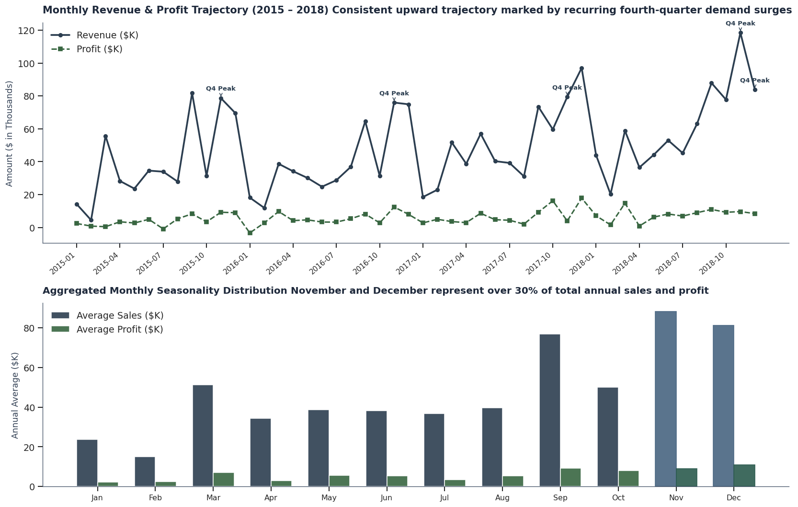
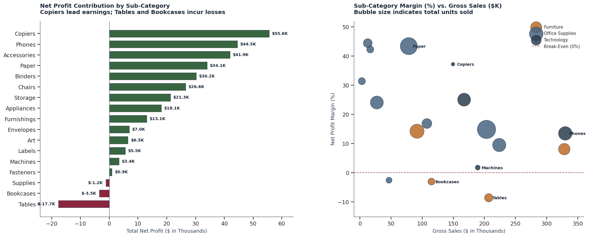
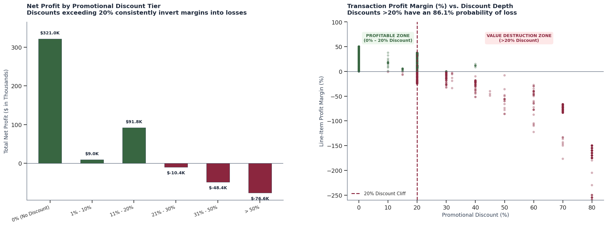
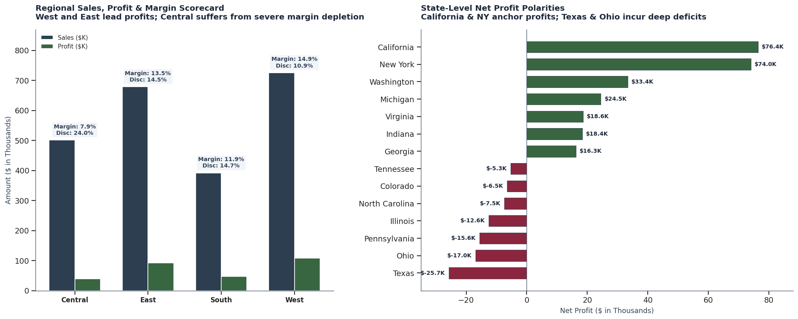
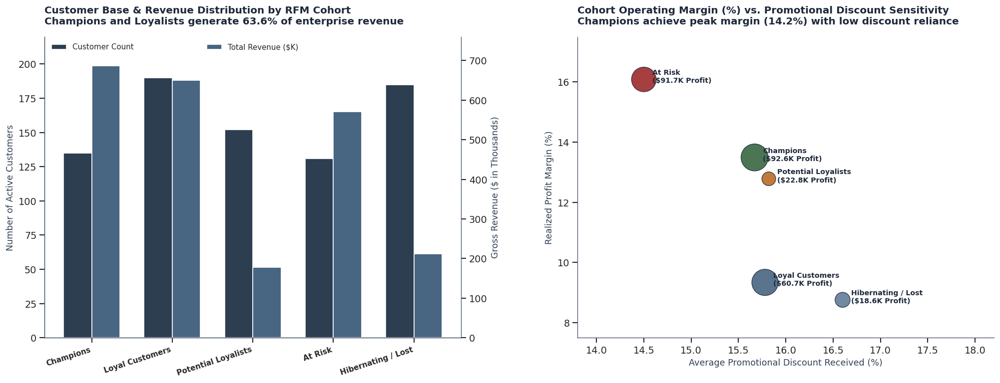

# Superstore Sales & Profitability Analysis

## Project Overview
An end-to-end data analysis project examining 9,994 retail transactions across the United States from 2015 to 2018. The analysis focuses on understanding revenue trajectories, diagnosing root causes of profit leakages, establishing pricing elasticity thresholds, and segmenting customer lifetime value to deliver actionable turnaround strategies.

---

## 1. What Was Built
* **Data Cleaning & Preprocessing Pipeline (`01_data_cleaning_and_preparation.ipynb`)**: Schema validation, missing postal code imputation, date transformation, duplicate verification, and feature engineering exported to `cleaned_superstore.csv`.
* **Exploratory Data Analysis & Business Insights (`02_business_insights_and_eda.ipynb`)**: Comprehensive analysis answering 5 core business questions with custom-styled, action-titled visualizations.
* **RFM Customer Segmentation Model**: Recency, Frequency, and Monetary scoring to classify 793 unique customers into behavioral cohorts.

---

## 3. Methodology & Key Results
### Analysis 1: Time Variation & Seasonal Demand
* **Result**: Annual sales grew by **+51.4%** from \$484.2K (2015) to \$733.2K (2018).
* **Key Finding**: November and December account for over **30% of annual revenue and orders**, showing a **3.8x volume surge** over early-year lows. Standard Class shipping fulfills 59.1% of orders with an average lead time of 5.01 days

### Analysis 2: Order & Profit Dynamics
* **Result**: Technology (\$145.5K profit, 17.40% margin) and Office Supplies (\$122.5K profit, 17.04% margin) are the main profit drivers.
* **Key Finding**: Furniture delivered an anemic **2.49% profit margin**. While **Copiers** (\$55.6K profit, 37.2% margin) and **Paper** (\$34.1K profit, 43.4% margin) are top earners, **Tables** (-\$17.7K loss) and **Bookcases** (-\$3.5K loss) burned over \$21,000 in bottom-line profits.
  
### Analysis 3: Discount Variation with Order Volume vs. Profit
* **Result**: Promotional discounts $\le 20\%$ maintain positive operating margins (+11.58% to +29.51%).
* **Key Finding**: Discounts $>20\%$ caused severe margin collapse (-10.05% for 21–30%, -24.80% for 31–50%, and -119.20% for $>50\%$). Across 1,393 transactions discounted beyond 20%, **86.1% incurred direct losses**, destroying **\$135,376.06 in cumulative net profits**.
  
### Analysis 4: Region-Wise Product Analysis
* **Result**: West (\$108.4K profit, 14.94% margin) and East (\$91.5K profit, 13.48% margin) lead the company in profit generation.
* **Key Finding**: The Central region generated \$501.2K in revenue but realized only **\$39,706.36 in profit** (7.92% margin). This was caused by heavy discounting in **Texas** (-\$25.7K loss, 37.2% avg discount) and **Illinois** (-\$12.6K loss, 39.0% avg discount), where over 53% of transactions were unprofitable.
  
### Analysis 5: Customer Segment & RFM Analysis
* **Result**: The top 38.7% of accounts (**Champions & Loyal Customers**) generated **66.52% of total business profits** (\$190.5K).
* **Key Finding**: Champions exhibited the highest profit margin (14.2%) with the lowest discount dependency, while 178 "At-Risk" customers accounted for substantial churn following introductory promotional discounts.
  
---
## 4. Technical Decisions & Choices
* **Modular 2-Notebook Architecture**: Separated data cleaning/preprocessing from downstream exploratory analysis. This ensures data preparation is reproducible and prevents code bloat in the analytical notebook.
* **Zero Data Loss Imputation**: 11 records missing postal codes were cross-referenced with City (`Burlington`) and State (`Vermont`) and imputed with official USPS ZIP `05401`, avoiding row deletion.
---
